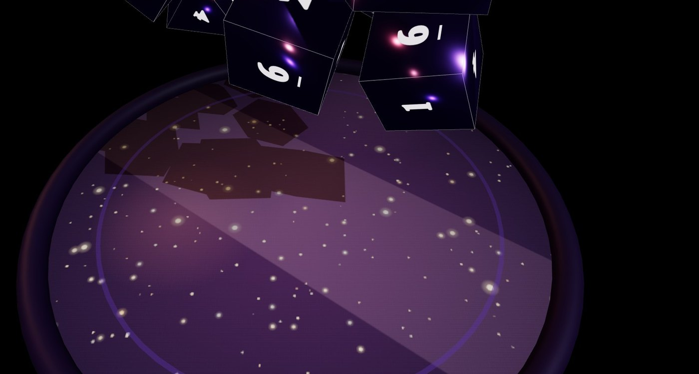
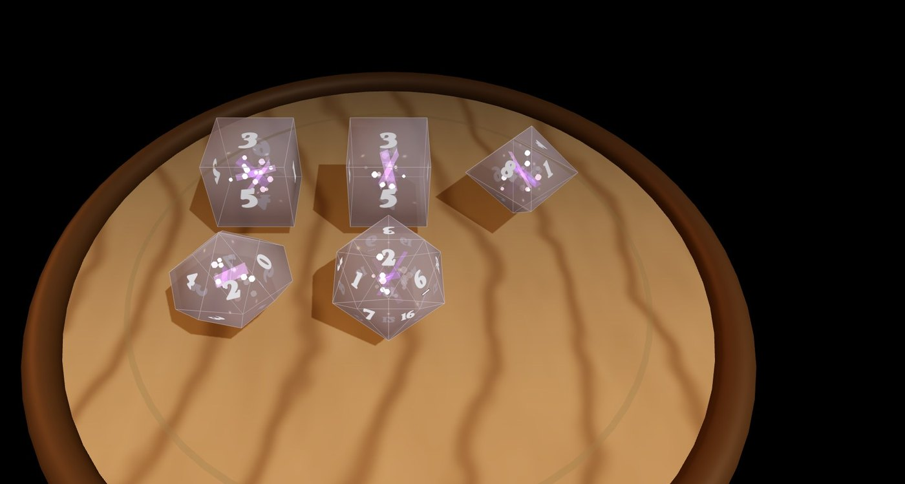
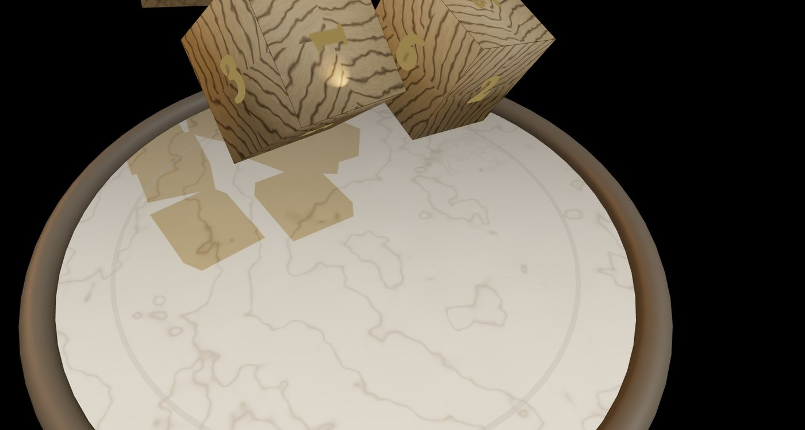

<div align="center">

# ⚜ ASTAROTH'S BONES ⚜

### アスタロトの骨子 — 3D TRPG ダイスロール

ブラウザでそのまま遊べる、3D 物理シミュレーション式 TRPG ダイスローラー。<br/>
中世魔導書を思わせる UI と、素材ごとに鳴り分けるモーダル合成サウンドで、卓上の没入感をそのまま Web に。

**▶ [ライブデモを開く](https://yamadar.github.io/trpg-dice-app/)**



</div>

---

## ✦ 特徴

- **多面体 7 種を完全対応** — D4 / D6 / D8 / D10 / D% / D12 / D20。`d10` と `d%` は自前の pentagonal trapezohedron で描画。
- **物理で転がる本物のダイス** — 重力・摩擦・反発・スピンを毎フレーム計算。出目は乱数ではなく上面検出で決まる。
- **6 種のボード × 5 種の素材 × 8 種の色テーマ** — 計 240 通りの組み合わせ。オーク卓、大理石、虚空、洞窟、古地図、戦場。フロスト、レジン、メタル、宝石、木材。
- **素材で鳴き分けるサウンド** — Tone.js + Web Audio によるモーダル合成（共鳴周波数・減衰・ノイズを物理ベースでプリセット化）。木・プラスチック・レジン・金属・水晶それぞれの打撃音をリアルに再現。
- **複合ダイス式** — `2d6 + 1d8 + 1d10 + 1d20` のような複数種混在＋修正値（MOD）に対応。合計と内訳を両方表示。
- **クリティカル / ファンブル検出** — D20 のナチュラル 20 / 1 を自動でハイライト。
- **ロール履歴** — 過去の式と合計を時系列でログ表示。
- **モバイル最適化** — タッチ操作・縦持ち対応。パネルは折りたたみ式で盤面を最大化。
- **インストール不要** — GitHub Pages に静的配信。共有 URL でそのまま遊べる。

## ✦ ギャラリー

<table>
  <tr>
    <td align="center" width="50%">
      <br/>
      <sub><b>オーク卓 × レジン × ネビュラ</b><br/>透過するレジン素材に紫の内包物が灯る</sub>
    </td>
    <td align="center" width="50%">
      <br/>
      <sub><b>大理石 × 木材 × 神聖</b><br/>白い大理石に落ちる木目のキューブ</sub>
    </td>
  </tr>
</table>

## ✦ 使い方

1. **[ライブデモ](https://yamadar.github.io/trpg-dice-app/)** を開く（または `npm run dev` をローカル実行）。
2. 左パネル「ダイス変更」で振りたい多面体の本数と MOD を設定。
3. 右パネル「スタイル」で素材・色・盤面を選ぶ。
4. `ROLL` ボタンか、盤面をタップすれば物理シミュレーションで転がる。
5. ダイスが停止すると上面の出目が読み取られ、内訳と合計が表示される。

## ✦ 技術スタック

| | |
| --- | --- |
| **レンダリング** | [Three.js](https://threejs.org/) (r160) — WebGL · カスタムジオメトリ · 影 · 木目テクスチャ · 内包物 |
| **物理** | 自前の簡易剛体シミュレーション（重力・反発・摩擦・角速度） |
| **サウンド** | [Tone.js](https://tonejs.github.io/) + Web Audio API — モーダル合成（共鳴フィルタバンク + ノイズバースト） |
| **UI** | [React 18](https://react.dev/) |
| **ビルド / テスト** | [Vite 6](https://vitejs.dev/) · [Vitest 3](https://vitest.dev/) |
| **デプロイ** | GitHub Pages（main への push で自動デプロイ） |

純粋ロジック（ダイス計算・設定データ）は `src/logic` / `src/data` に分離されており、Vitest で 50 件のユニットテストがある（RNG は注入可能）。

## ✦ 開発

```bash
npm install        # 初回のみ
npm run dev        # http://localhost:5173/ で開発サーバー（自動で開く）
npm test           # Vitest を 1 回実行
npm run build      # dist/ に本番ビルド
npm run format     # Prettier
```

設計の詳細・モジュール構成・`App.jsx` の行範囲別内訳は [`docs/ARCHITECTURE.md`](./docs/ARCHITECTURE.md) を参照。

## ✦ ライセンス

[MIT](./LICENSE)
